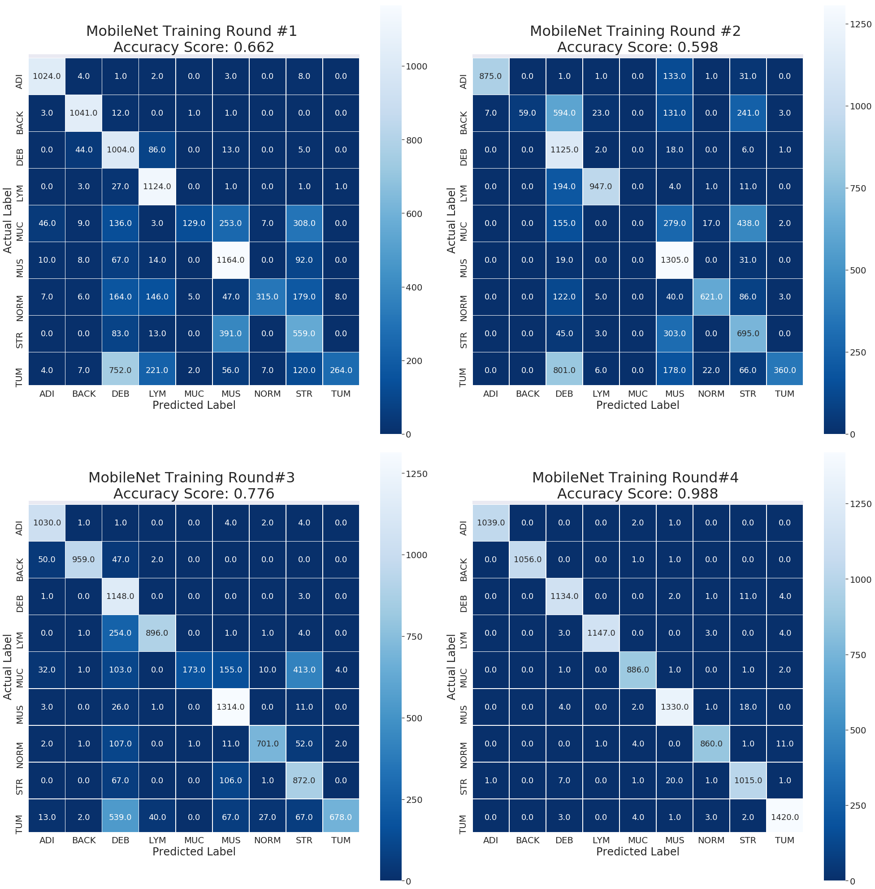
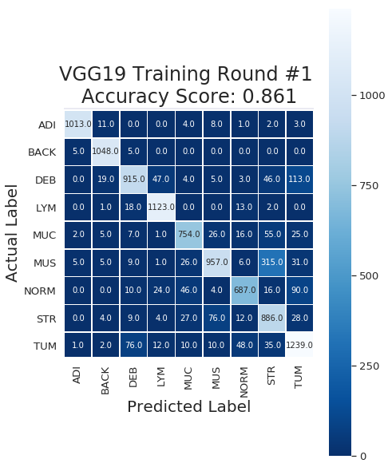
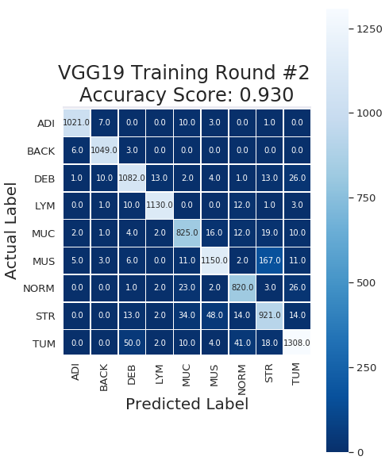
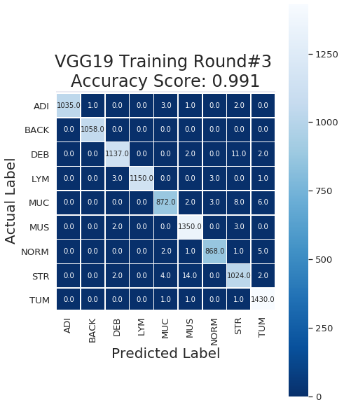

# Colorectal-Cancer-Multi-Class-Tissue-Classification
Deep neural network to identify nine different tissue types that are abundant in histological images of CRC biopsy images


# Multi Tissue classification from Microscopic-Tissue Images with Deep Learning (Transfer Learning)
[](https://travis-ci.org/joemccann/dillinger)

```
Domain 		: Computer Vision, Machine Learning
Sub-Domain	: Deep Learning, Image Recognition
Techniques	: Deep Convolutional Neural Network (CNN), Transfer Learning, ImageNet, MobileNet, VGG19, ResNet50 
Application	: Image Classification, Medical Imaging, Medical Imaging
```


## Description
* Developed an automated classification, aimed at categorizing the homogeneous tissue regions into a 9 tissue classes: Adipose tissue, Background, Debris, Lymphocyte aggregates, Mucus, Muscle, Normal mucosa, Stroma, Tumor epithelium
* For training, concatenated dropout and dense layers to the output layer for final output prediction.
* Tested three CNN architectures: VGG19, ResNet50 and MobileNet.
* The best model attained a testing accuracy of >99.72% accuracy and >94% accuracy on an external dataset,Dataset
Dataset Name     : NCT-CRC-HE-100K, CRC-VAL-HE-7K

## Dataset Details
Dataset Links: [NCT-CRC-HE-100K](https://zenodo.org/record/1214456), [CRC-VAL-HE-7K](https://zenodo.org/record/1214456)

Original Paper      :  [Kather JN, Krisam J, Charoentong P, Luedde T, Herpel E, Weis C-A, et al. (2019) Predicting survival from colorectal cancer histology slides using deep learning: A retrospective multicenter study. PLoS Med 16(1): e1002730.](https://doi.org/10.1371/journal.pmed.1002730)
                   
Dataset Name: NCT-CRC-HE-100K, CRC-VAL-HE-7K
Number of Classes		    : 9

## Tools/ Libraries
```
Languages               : Python
Tools/IDE               : Anaconda, Jupyter Notebook
Libraries               : TensorFlow2.0, ResNet50, VGG19, MobileNet, ImageNet, Matplotlib
```

## Performance Metrics
|           | Acc. Test Data | Loss Test Data | Acc. External Data | Loss External Data |
| ----------| -------------- | ---------------|------------------- |------------------- |
|  VGG19    |      0.991     |     0.031      |       0.190        |       0.939        |
| MobileNet |      0.987     |     0.042      |       0.915        |       0.399        | 
| ResNet50  |      0.96      |    0.992       |      0.927         |       0.339        |


## Model and Training Parameters
| Parameter | Value |
| --------- | ----- |
| Base Model |VGG19, ResNet50, MobileNet	| 
| Optimizer | Adam, Stochastic Gradient Descent |
| Loss Function | Categorical Crossentropy |
| Learning Rate | 0.0001, 0.0004 |
| Number of Epochs | 10, 25 |	

## Model Predictions


## Confusion Matrices
### Performance of ResNet50 on Test Data


### Performance of MobileNet on Test Data


### Performance of VGG19 on Test Data



